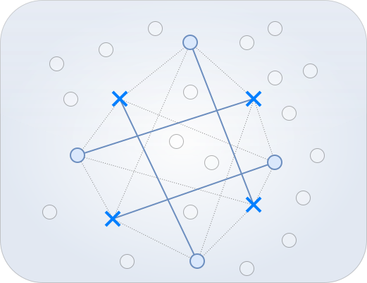

[](LICENSE)
[](https://arxiv.org/abs/2601.06351)

# **ABA - The Assignment-based Anticlustering Algorithm**

A fast and effective heuristic for Anticlustering in Euclidean spaces.

---

## Installation

1. Clone this repository  
2. Create and activate a virtual environment
3. Install the required dependencies (see requirements.txt)

## Usage

- To run the base version of ABA, look at the example in running_aba_base_version.py.
- To run ABA for small anticlusters (of size 2), look at the example in running_aba_for_small_anticlusters.py.
- To run ABA with categories, look at the example in running_aba_with_categories.py.
- To run ABA with hierarchical decomposition, look at the example in running_aba_with_hierarchical_decomposition.py

## Reference

If you use this algorithm in your research, please cite the following paper:

Baumann, P., Goldschmidt O., Hochbaum D.S., Yang J. (2026). A Fast and Effective Method for Euclidean Anticlustering: The Assignment-Based-Anticlustering Algorithm. Working paper.

Bibtex:
```
@misc{baumann2026fasteffectivemethodeuclidean,
      title={A Fast and Effective Method for Euclidean Anticlustering: The Assignment-Based-Anticlustering Algorithm}, 
      author={Philipp Baumann and Olivier Goldschmidt and Dorit S. Hochbaum and Jason Yang},
      year={2026},
      eprint={2601.06351},
      archivePrefix={arXiv},
      primaryClass={cs.LG},
      url={https://arxiv.org/abs/2601.06351}, 
}
```

## License

This project is licensed under the MIT License - see the [LICENSE](LICENSE) file for details.